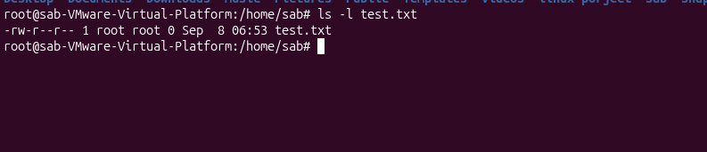
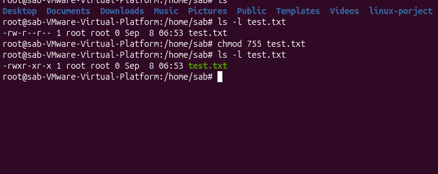
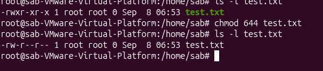
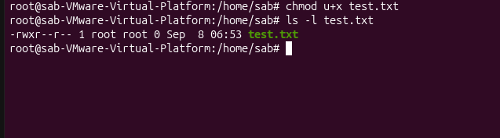

# Linux chmod Lab

## 🎯 Objective
Practice Linux file permissions using the `chmod` command and understand numeric and symbolic permission modes.

## 🔐 Linux File Permissions

Linux permissions are divided into three groups:

- **u (user/owner)** — the file owner
- **g (group)** — the file's group
- **o (others)** — everyone else

Permission types:

| Symbol | Permission | Meaning |
|---|---|---|
| `r` | Read | Read the file |
| `w` | Write | Modify the file |
| `x` | Execute | Execute the file |

## 🧪 Practical Lab

### 1. Check the initial permissions

```bash
touch test.txt
ls -l test.txt
```

Initial result:

```text
-rw-r--r-- ... test.txt
```

This represents permission mode **644**.



### 2. Change permissions to 755

```bash
chmod 755 test.txt
ls -l test.txt
```

Result:

```text
-rwxr-xr-x ... test.txt
```

Meaning:

- Owner: `rwx`
- Group: `r-x`
- Others: `r-x`



### 3. Change permissions to 644

```bash
chmod 644 test.txt
ls -l test.txt
```

Result:

```text
-rw-r--r-- ... test.txt
```

Meaning:

- Owner: `rw-`
- Group: `r--`
- Others: `r--`



### 4. Use symbolic permissions

```bash
chmod u+x test.txt
ls -l test.txt
```

This adds execute permission (`x`) to the owner (`u`).

Result:

```text
-rwxr--r-- ... test.txt
```



## 🔢 Numeric Permission Values

| Permission | Value |
|---|---:|
| Read (`r`) | 4 |
| Write (`w`) | 2 |
| Execute (`x`) | 1 |

Examples:

- `7 = 4 + 2 + 1 = rwx`
- `6 = 4 + 2 = rw-`
- `5 = 4 + 1 = r-x`
- `4 = r--`

Therefore:

```text
755 = rwxr-xr-x
644 = rw-r--r--
```

## ✅ What I Practiced

- Checking file permissions with `ls -l`
- Changing permissions with numeric `chmod`
- Using `chmod 755`
- Using `chmod 644`
- Using symbolic permissions with `chmod u+x`
- Understanding `r`, `w`, and `x`

## 🛠️ Environment

- Linux / Ubuntu
- Bash
- `chmod`
- `ls`
